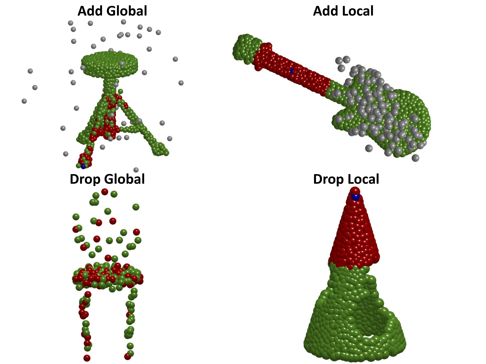

# EPiC: Ensemble of Partial Point Clouds for Robust Classification
Official pytorch implementation of the paper ["EPiC: Ensemble of Partial Point Clouds for Robust Classification"](https://arxiv.org/abs/2303.11419).

Meir Yossef Levi, Guy Gilboa



We propose a novel approach to robustify performance of point-cloud classification networks against corruptions and outliers. 
Our method is based on ensemble of 3 types of sub-samples: Patches, Curves and Random. It can be applied to any given point-cloud network and achieve state-of-the-art results on [ModelNet-C](https://github.com/jiawei-ren/ModelNet-C) by using RPC+WolfMix (mCE=0.501).

## Get Started

### Step 0. Clone the Repo
```shell
git clone https://github.com/yossilevii100/EPiC.git
cd EPiC
```

### Step 1. Set Up the Environment
Set up the environment by:
```shell
pip install -r requirements.txt
cd pointnet2_ops_lib
python setup.py build
cd ..
pip install -e modelnetc_utils
```

### Step 2. Prepare Data
Download ModelNet-40 by:

```shell
cd data
wget https://shapenet.cs.stanford.edu/media/modelnet40_ply_hdf5_2048.zip
unzip modelnet40_ply_hdf5_2048.zip && cd ..
```

Alternatively, you may download [ModelNet40](https://shapenet.cs.stanford.edu/media/modelnet40_ply_hdf5_2048.zip) manually and extract it under `data`.

Download ModelNet-C by:
```shell
cd data
gdown https://drive.google.com/uc?id=1KE6MmXMtfu_mgxg4qLPdEwVD5As8B0rm
unzip modelnet_c.zip && cd ..
```
Alternatively, you may download [ModelNet40-C](https://drive.google.com/file/d/1KE6MmXMtfu_mgxg4qLPdEwVD5As8B0rm/view?usp=sharing) manually and extract it under `data`.

Make sure your data folders are as follows:

```
data
--- modelnet_c
------ list of h5 files
--- modelnet40_ply_hdf5_2048
------ list of h5 files
```

### Step 3. Download Pretrained Models
Download pretrained models by
```shell
gdown https://drive.google.com/uc?id=15Q-YewNGvte8PmteVjTmqE0vzDL3ViJd
unzip pretrained.zip -d pretrained
```
Alternatively, you may download [pretrained models](https://drive.google.com/uc?id=15Q-YewNGvte8PmteVjTmqE0vzDL3ViJd) manually and extract it under root directory.

### Evaluation Commands
Evaluation commands are provided in [EVALUATE.md](EVALUATE.md).

### Customize EPiC training+evaluation for your custom model
In order to ease the way for future researchers we implement a placeholder for new custom model.
All you have to do is implement your custom model in `models/custom/custom_model`

* Augmented by WolfMix:

Train:
```shell
python main.py --model custom_model --train_random --train_curves --train_patches --use_wolfmix --exp_name <your_exp_name> --use_wolfmix
```

After the training procedure finished, evaluate your model with EPiC by:
```shell
python main.py --model custom_model --eval --model_path_patches <path/to/project>/checkpoints/<your_exp_name>/models/custom_model_patches_wm.t7 --model_path_curves <path/to/project>/checkpoints/<your_exp_name>/models/custom_model_curves_wm.t7 --model_path_random <path/to/project>/checkpoints/<your_exp_name>/models/custom_model_random_wm.t7
```

* Un-augmented:

Train:
```shell
python main.py --model custom_model --train_random --train_curves --train_patches --exp_name <your_exp_name>
```
After the training procedure finished, evaluate your model with EPiC by:
```shell
python main.py --model custom_model --eval --model_path_patches <path/to/project>/checkpoints/<your_exp_name>/models/custom_model_patches.t7 --model_path_curves <path/to/project>/checkpoints/<your_exp_name>/models/custom_model_curves.t7 --model_path_random <path/to/project>/checkpoints/<your_exp_name>/models/custom_model_random.t7
```

### Results on ModelNet-C
Our method achieves SOTA results on ModelNet-C, with and without augmentation.
Moreover, our approach is improved each of the examined networks in terms of robustness.

With WolfMix Augmentation

| Method          | Reference                                                  |  mCE  | Clean OA |
| --------------- | ---------------------------------------------------------- | :---: | :------: |
| DGCNN           | [Wang et al.](https://arxiv.org/abs/1801.07829)            | 0.590 |   0.932  |
| DGCNN-EPiC      | [Wang et al.](https://arxiv.org/abs/1801.07829)            | 0.529 |   0.921  |
| --------------- | ---------------------------------------------------------- | :---: | :------: |
| GDANet          | [Xu et al.](https://arxiv.org/abs/2012.10921)              | 0.571 |   0.934  |
| GDANet-EPiC     | [Xu et al.](https://arxiv.org/abs/2012.10921)              | 0.530 |   0.925  |
| --------------- | ---------------------------------------------------------- | :---: | :------: |
| PCT             | [Guo et al.](https://arxiv.org/abs/2012.09688)             | 0.574 |   0.934  |
| PCT-EPiC        | [Guo et al.](https://arxiv.org/abs/2012.09688)             | 0.510 |   0.927  |
| --------------- | ---------------------------------------------------------- | :---: | :------: |
| RPC             | [Ren et al.](https://arxiv.org/abs/2202.03377) 	           | 0.601 |   0.933  |
| RPC-EPiC        | [Ren et al.](https://arxiv.org/abs/2202.03377) 	           | 0.501 |   0.927  |


Without WolfMix Augmentation

| Method          | Reference                                                  |  mCE  | Clean OA |
| --------------- | ---------------------------------------------------------- | :---: | :------: |
| DGCNN           | [Wang et al.](https://arxiv.org/abs/1801.07829)            | 1.000 |   0.926  |
| DGCNN-EPiC      | [Wang et al.](https://arxiv.org/abs/1801.07829)            | 0.669 |   0.930  |
| --------------- | ---------------------------------------------------------- | :---: | :------: |
| GDANet          | [Xu et al.](https://arxiv.org/abs/2012.10921)              | 0.892 |   0.934  |
| GDANet-EPiC     | [Xu et al.](https://arxiv.org/abs/2012.10921)              | 0.704 |   0.936  |
| --------------- | ---------------------------------------------------------- | :---: | :------: |
| PCT             | [Guo et al.](https://arxiv.org/abs/2012.09688)             | 0.925 |   0.930  |
| PCT-EPiC        | [Guo et al.](https://arxiv.org/abs/2012.09688)             | 0.646 |   0.930  |
| --------------- | ---------------------------------------------------------- | :---: | :------: |
| RPC             | [Ren et al.](https://arxiv.org/abs/2202.03377) 	           | 0.863 |   0.930  |
| RPC-EPiC        | [Ren et al.](https://arxiv.org/abs/2202.03377) 	           | 0.750 |   0.936  |
| --------------- | ---------------------------------------------------------- | :---: | :------: |
| CurveNet        | [Xiang et al.](https://arxiv.org/abs/2105.01288)           | 0.927 |   0.938  |
| CurveNet-EPiC   | [Xiang et al.](https://arxiv.org/abs/2105.01288)           | 0.742 |   0.921  |


## Cite EPiC
```bibtex
@article{
    epic
    title={EPiC: Ensemble of Partial Point Clouds for Robust Classification.},
    author={Levi Meir Yossef and Guy Gilboa},
    journal={arXiv:2303.11419},
    year={2023},
}
```


## Acknowledgement
This codebase heavily borrows codes from the following repositories:
- [ModelNet-C](https://github.com/jiawei-ren/ModelNet-C)
- [DGCNN](https://github.com/WangYueFt/dgcnn/tree/master/pytorch)
- [PCT_Pytorch](https://github.com/Strawberry-Eat-Mango/PCT_Pytorch)
- [GDANet](https://github.com/mutianxu/GDANet)
- [CurveNet](https://github.com/tiangexiang/CurveNet)
- [RSMix](https://github.com/dogyoonlee/RSMix)
- [PointWOLF](https://github.com/mlvlab/PointWOLF)


